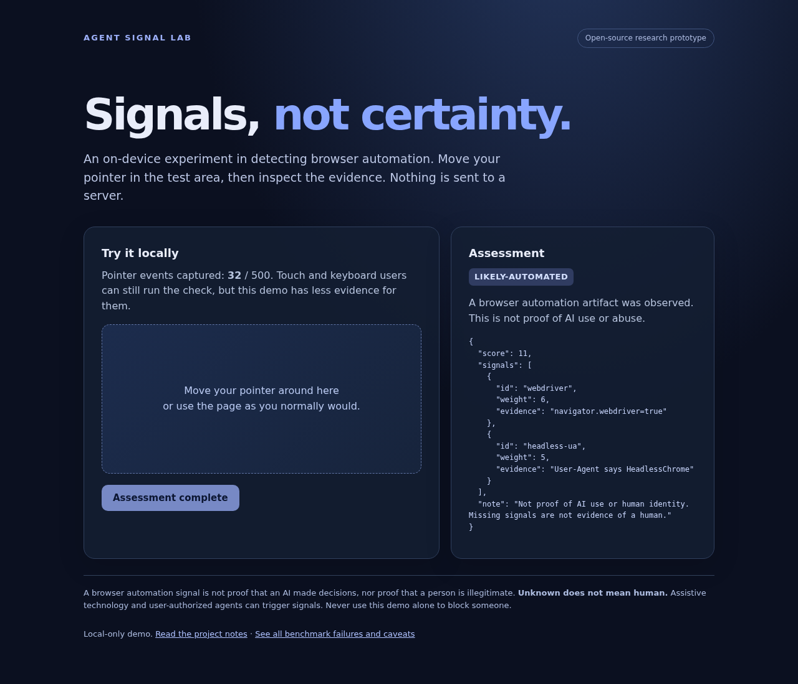

# Agent Signal Lab

**An explainable, local-first browser automation signal experiment.** It detects a few automation artifacts and unusual pointer patterns. It does not prove a session is human or that an AI model made decisions. Most uncertain sessions return `unknown` or `review`; neither should cause an automatic block.



## Try it

Requires Node 20+ for tests and a local web server for the browser demo. No API keys or account are needed.

```bash
npm ci
npm test
python3 -m http.server 8000
# Open http://localhost:8000/examples/demo.html
```

The demo gathers at most 500 pointer movements and checks browser properties **in that browser**. It does not upload, save, or send your interaction data. You can inspect every rule in [`src/detect.js`](src/detect.js).

```js
import { browserSnapshot, scoreSignals } from './src/detect.js';
const capture = browserSnapshot();
// After the user's interaction, in a browser:
const result = scoreSignals(capture.finish());
console.log(result.classification, result.signals);
```

Results are `likely-automated` only when an explicit automation artifact is observed, `review` for behavior-only anomalies, and `unknown` when evidence is insufficient. The score is **not a probability**. A human using assistive tools or browser automation can trigger artifacts, while a bot can hide them. Never use these verdicts as a sole access-control decision.

## What we measured

| Test | Agent Signal Lab | BotD 2.0.0 | bot-signal 2.0.14 |
| --- | ---: | ---: | ---: |
| Six controlled Chrome automations: stock and masked Playwright, Puppeteer and Selenium | 6/6 likely automated | 4/6 bot | 6/6 not legitimate |
| Same six automated cases, headed under Xvfb | 6/6 | 4/6 | 6/6 |

These are **positive-case smoke tests**, not accuracy rates. All three detectors saw the same local browser page; each used its normal client-side instant check. Our scorer was supplied the new own-property webdriver boolean in the same snapshot. No live human controls were present. Own-property webdriver shadowing catches masked Playwright and Puppeteer; a ChromeDriver constructor alias catches masked Selenium. These exact rules were developed on this six-case matrix, and have not been tested on a matched live human browser cohort. A tie with bot-signal on these automated positives is **not** state of the art or proof of real-world accuracy.

Independent human controls from [The Attentive Cursor Dataset](https://gitlab.com/iarapakis/the-attentive-cursor-dataset): 2,909 older web-search trajectories, one per crowdworker. Our unchanged event-only scorer returned 0 `likely-automated`, 1 `review`, and 2,908 `unknown`. It received no live navigator fields, unlike the Chrome tests, and is **not a matched false-positive estimate**. Sparse 150-ms sampled mouse events, one site family, and no accessibility or mobile strata limit it.

A 2020 bot-detection mouse-trace test sent 30/30 simulated bots and 0/30 human comparison records to **review**, not an automation verdict. A 5,000-session human game-input stress test sent 170 sessions to review; that finding led us to demote behavior-only evidence. Those game ticks are not browser events. More details, failures, source links and reproduction commands are in [BENCHMARK.md](BENCHMARK.md).

## Reproduce

```bash
npm run bench              # Four Playwright variants, writes ignored bench/results.json
npm run bench:frameworks   # Six framework/profile variants; local Chrome required
npm run bench:headed       # Same six cases in headed Chrome under Xvfb
```

The framework scripts default to `/usr/bin/google-chrome`; set `CHROME_PATH=/path/to/chrome` to use another installation. The recorded run used Chrome 151.0.7922.137. The webdriver own-property and ChromeDriver-alias rules were added after inspecting this six-profile matrix, so its new 6/6 result is development-set performance, not a held-out confirmation. A separately launched headed Chrome with AutomationControlled disabled returned `unknown`, but it was CDP-observed, not human-driven; see [the benchmark notes](BENCHMARK.md). Node dependencies and baseline versions are in `package-lock.json`. For the independent human negative control, clone [the public source dataset](https://gitlab.com/iarapakis/the-attentive-cursor-dataset) to the gitignored `data/attentive-cursor` directory, then run `npm run bench:attentive`. External datasets are **not included** in this MIT-licensed repository; obey each source's separate terms. We deliberately do not bundle FP-Agent's raw corpus, Iliou's CC BY-NC-SA dataset, or a license-gated CAPTCHA dataset. [The full evaluation protocol](bench/EVAL_PROTOCOL.md) describes the crossed, held-out test needed for a serious claim.

## Why abstain?

A fingerprint, automation runtime marker, cursor trajectory, and AI-authored action are different things. A client can forge signals. On the publicly released FP-Agent raw event corpus, our unchanged event-only rule missed all 7,182 agent sessions. A mousemove-to-click shortcut that looked promising on that corpus missed every one of 30 simulated bots in an independent dataset. These are documented **failures**, not hidden training cases or evidence of generalization. [See the methods and denominators](BENCHMARK.md).

For an actual website, obtain consent for data collection; use purpose-limited retention, accessible fallbacks, and a process for disputing a flag. Distinguish authorized agents from abuse in policy, rather than treating automation as wrongdoing. Don't log raw fingerprint or behavior streams just because this code can inspect them.

## Prior art and scope

- [bot-signal](https://github.com/okasi/bot-signal) and [Fingerprint BotD](https://github.com/fingerprintjs/BotD) are real baselines, not straw men; both beat this prototype on at least part of our Chrome matrix.
- [FP-Agent](https://arxiv.org/abs/2605.01247) reports a trained fingerprint-plus-behavior method. We reproduced its released model on its own vector split, not an independent cross-site result.
- [Akamai's industry study](https://www.akamai.com/blog/security-research/identifying-agentic-automation-behavioral-telemetry-part-2) reports much broader proprietary tests. Its data and model are not public for a head-to-head reproduction.

This is an MIT-licensed research prototype, not a production service. Contributions that improve cross-site evidence, accessibility, privacy, or evaluation rigor are welcome. See [contribution notes](CONTRIBUTING.md), [security guidance](SECURITY.md), [the results table with units](docs/methods.md), and the [release checklist](RELEASE_CHECKLIST.md). Release only after reviewing the final repository, dependency licenses, datasets, and exact public claims.
